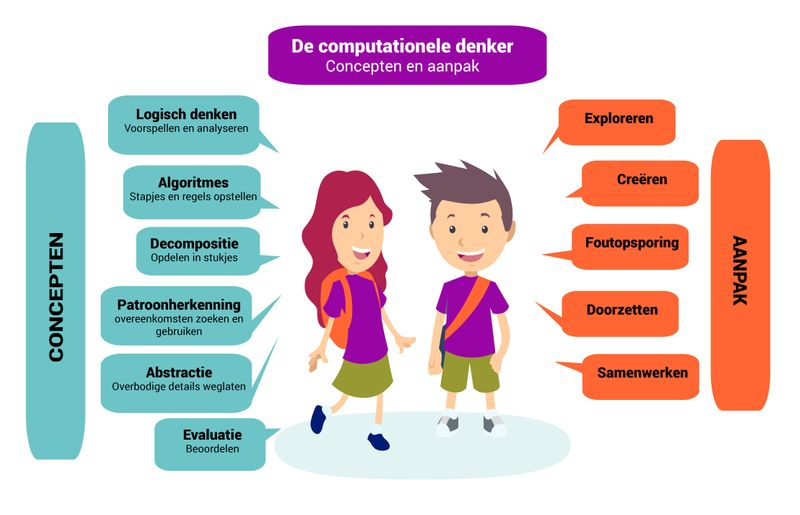

  <h4>Eindterm: computationeel denken</h4>
  
De leerlingen ontwerpen algoritmes om problemen digitaal op te lossen. 

## Wat is computationeel denken? Meer dan alleen maar programmeren.
Een computer wint gemakkelijk van een schaakmeester of de beste Go-speler. En Google Assistent kan met artificiële intelligentie een afspraak bij de kapper maken. 
Maar toch zijn computers niet slim. Ze voeren instructies uit die mensen hebben geprogrammeerd. Computationeel denken is niet gewoon programmeren, maar **gaat om het denkniveau daarboven**.

  
<i>“<b>Computational Thinking</b> is the thought processes involved in formulating problems and their solutions so that the solutions are represented in a form that can be effectively carried out by an information-processing agent.” (Jeannette M. Wing, 2008)</i> 

Computationeel denken verwijst dus naar het menselijke vermogen om complexe problemen te herformuleren zodat oplossingen effectief kunnen weergegeven en verwerkt worden door iemand die de informatie doorneemt. Daarbij kunnen computers als hulpmiddel gezien worden. Met andere woorden, computationeel denken is het proces waarbij aspecten van informaticawetenschappen herkend worden in de ons omringende wereld, en waarbij de methodes en technieken uit de informaticawetenschappen toegepast worden om problemen uit de fysische en virtuele wereld te begrijpen en op te lossen. 

Computationeel denken is dus meer dan programmeren. Onderstaande figuur legt computationeel denken schematisch uit:

{:data-caption="Overzicht computationeel denken"}

## Wat is programmeren?
Programmeren illustreert het computationeel denken. Het leidt tot concrete, toonbare resultaten. Programmeren biedt aanmoediging voor creativiteit, logisch denken, nauwkeurig werken en probleemoplossende vaardigheden. 

Programmeren is het ontwerpen en schrijven van een reeks instructies (een programma) voor een computer en dit in een voor de computer begrijpbare taal.
Programmeren kan heel eenvoudig zijn, zoals een programma om een robot een lijn te laten volgen, maar ook ongelooflijk ingewikkeld en complex – denk maar aan de
software waarmee het weer wordt voorspeld of waarmee zoekresultaten in Google worden weergegeven.

* Eerst komt het erop aan een probleem te analyseren en een oplossing te bedenken. In deze stap maak je gebruik van logisch redeneren, decompositie, abstractie en
patronen om algoritmen te ontwerpen waarmee je het probleem of systeem kunt oplossen of modelleren. Een algoritme is een geheel van instructies die je stapsgewijs uitvoert om een probleem op te lossen. Een recept dus. Zo gebruikt Jeroen Meus een algoritme bij het koken en bij IKEA krijg je ook een algoritme om een kast in elkaar te steken. <i>Professor informaticawetenschappen Frank Neven (<a href="https://www.klasse.be/213656/kunnen-jouw-leerlingen-al-computationeel-denken/">Klasse</a>)</i>.
* De ideeën die uit de eerste stap voortvloeien, moet je uitschrijven in een welbepaalde programmeertaal op een computer. Dit noemen we ‘coderen’. De reeks instructies die het programma vormen, noemen we de ‘code’.

Daarom zullen we in deze cursus de basisbeginselen van het programmeren aanleren.
