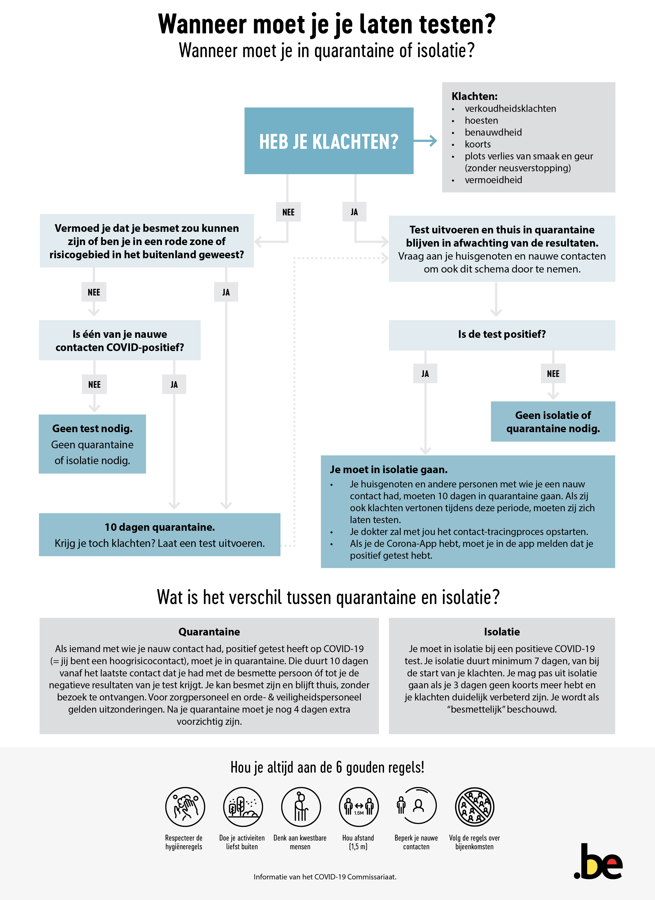
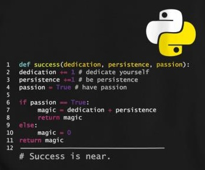

  <h4>Eindterm: computationeel denken</h4>
  
De leerlingen ontwerpen algoritmes om problemen digitaal op te lossen. 

## Wat is computationeel denken? Meer dan alleen maar programmeren.
Een computer wint gemakkelijk van een schaakmeester of de beste Go-speler. En Google Assistent kan met artificiële intelligentie een afspraak bij de kapper maken. 
Maar toch zijn computers niet slim. Ze voeren instructies uit die mensen hebben geprogrammeerd. Computationeel denken is niet gewoon programmeren, maar **gaat om het denkniveau daarboven**. 

  
<i>“<b>Computationeel denken</b> als term werd geïntroduceerd door Jeannette Wing (2006) om een verzameling mentale gereedschappen aan te duiden die nodig zijn om computers effectief in te kunnen zetten. Hiertoe behoren analytische vaardigheden om problemen zodanig te kunnen formuleren dat we computers en andere gereedschappen kunnen gebruiken om ze te helpen oplossen, en ook probleemoplossend vermogen, zoals het zoeken van oplossingen in termen van algoritmen en gegevens.”</i> 

Computationeel denken verwijst dus naar het menselijke vermogen om complexe problemen op te lossen en daarbij computers als hulpmiddel te zien. Met andere woorden, computationeel denken is het proces waarbij aspecten van informaticawetenschappen herkend worden in de ons omringende wereld, en waarbij de methodes en technieken uit de informaticawetenschappen toegepast worden om problemen uit de fysische en virtuele wereld te begrijpen en op te lossen. 

Onderstaande figuur legt computationeel denken schematisch uit:

{:data-caption="Overzicht computationeel denken"}

Computationeel denken heeft dus niets te maken met nadenken over computers of redeneren zoals een computer. Wel is het zo dat **programmeren** ideaal is om computationeel denken in de praktijk te brengen. Je leert zo wat een algoritme, een programma, variabelen, condities of decompositie is. Dat klinkt complex, maar zelfs Jeroen Meus schrijft algoritmen. Een algoritme is een geheel van instructies die je stapsgewijs uitvoert om een probleem op te lossen. Een recept dus. En bij IKEA krijg je ook een algoritme om een kast in elkaar te steken. <i>Professor informaticawetenschappen Frank Neven (<a href="[https://www.vrt.be/vrtnws/nl/2017/12/04/opinie-frederik-de-bosschere-algoritmes/](https://www.klasse.be/213656/kunnen-jouw-leerlingen-al-computationeel-denken/)">Klasse</a>)</i>.

Daarom zullen we in deze cursus de basisbeginselen van het programmeren aanleren.

## Wat is een algoritme?

  
Een algoritme is een geheel aan instructies die stapsgewijs uitgevoerd kunnen worden om een probleem op te lossen.

Je kent al heel wat voorbeelden van algoritmes in het dagelijks leven:

  
  
  

Een algoritme wordt een programma als het geschreven wordt op zo’n manier dat het rechtstreeks kan uitgevoerd worden door een computer.

## Algoritmisch denken

  
...algoritmes domineren de wereld. Ze bepalen uw Google-zoekresultaten, Wazen u door de ochtendspits, houden uw mailbox spamvrij. Algoritmes leiden ons leven in nagenoeg elk opzicht. <i>Frederik De Bosschere (VRT NWS  <a href="https://www.vrt.be/vrtnws/nl/2017/12/04/opinie-frederik-de-bosschere-algoritmes/">04-12-2017</a>)</i>

  
Algoritmen vormen de bouwstenen van onze digitale samenleving. De volgende video is een ideale smaakmaker om je warm te maken voor algoritmisch denken of computationeel denken.

<iframe width="560" height="315" src="https://www.youtube.com/embed/nKIu9yen5nc" title="YouTube video player" frameborder="0" allow="accelerometer; autoplay; clipboard-write; encrypted-media; gyroscope; picture-in-picture" allowfullscreen></iframe>

Algoritmes zijn tegenwoordig werkelijk overal:
* Als je via een streaming muziekdienst naar muziek luistert, leert het algoritme je muzikale smaak steeds beter kennen. Op basis daarvan kan het algoritme je nieuwe muziek suggereren die je waarschijnlijk ook goed zult vinden.
* Sociale media werken op precies dezelfde manier. Wanneer je ergens op klikt of een like achterlaat, leert het bedrijf je weer wat beter kennen. Daardoor kunnen ze je ook steeds beter bestoken met informatie (of advertenties) waarvan ze denken dat je ze leuk gaat vinden.
* Heb je je al eens afgevraagd hoe een routeplanner werkt? Dat lijkt erg ingewikkeld: hoe kun je gegarandeerd de snelste weg van A naar B vinden? Toch valt dat mee: je hoeft niet meer te doen dan het toepassen van een relatief eenvoudig algoritme dat de Nederlandse wiskundige en informaticus Edsger Dijkstra (1930 – 2002) al in 1959 ontwikkelde.
* Ook in sectoren waar je het misschien niet meteen verwacht, worden algoritmes steeds belangrijker. Artsen worden bijgestaan door software bij het stellen van een diagnose. Wanneer iemand een lening wilt aangaan bij een bank, is het een algoritme dat de kredietwaardigheid van die persoon onderzoekt. Algoritmes duiken ook op in vakgebieden waar je het niet verwacht: taalkundigen, archeologen en bijbelwetenschappers gebruiken tegenwoordig algoritmes bij hun wetenschappelijk onderzoek.
