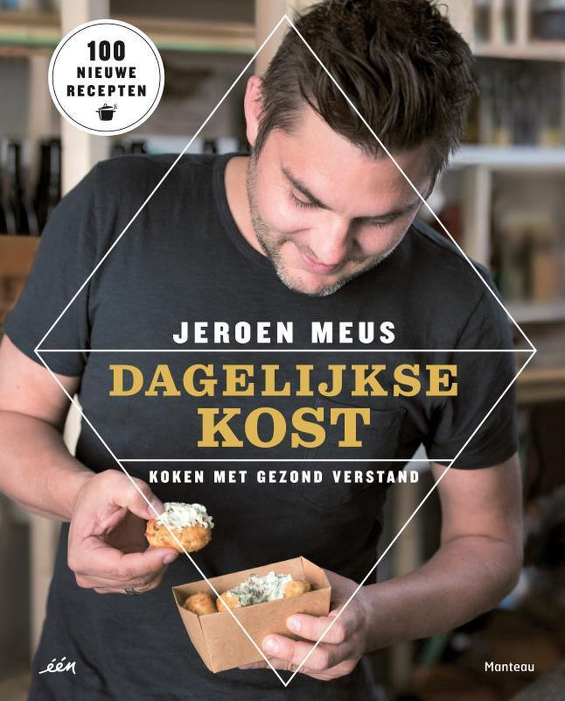
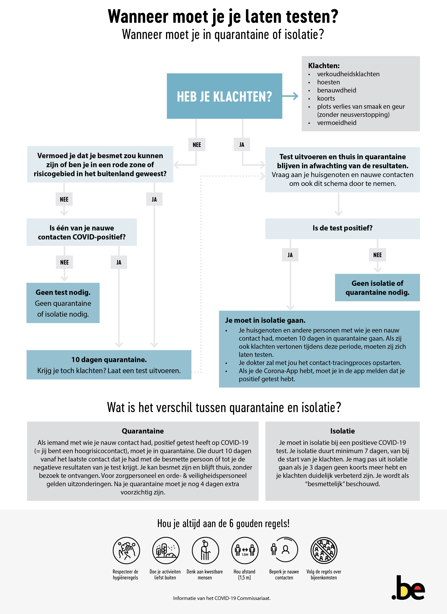
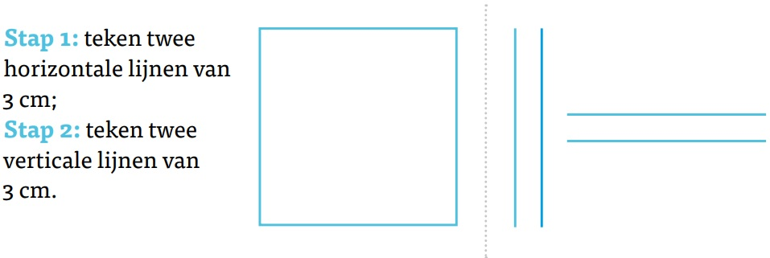
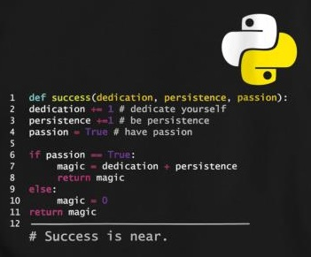

## Wat is een algoritme?

  
Een algoritme is een geheel aan instructies die stapsgewijs uitgevoerd kunnen worden om een probleem op te lossen.

Je kent al heel wat voorbeelden van algoritmes in het dagelijks leven:

  
  
  

* In de lagere school heb je leren cijferen. De juf of meester heeft je bijvoorbeeld een stappenplan aangeleerd om een natuurlijk getal (het deeltal) te delen door een ander natuurlijk getal (de deler). Door dat stappenplan toe te passen, kom je gegarandeerd bij de juiste oplossing uit – op voorwaarde dat je geen rekenfouten maakt. De staartdeling van natuurlijke getallen is dus een voorbeeld van een algoritme.
* In de eerste graad van het secundair onderwijs heb je geleerd hoe je een getal kunt ontbinden in priemfactoren en hoe je het kleinste gemene veelvoud kunt vinden van twee getallen. Dit zijn twee voorbeelden van algoritmes.
* Een recept in een kookboek is een stappenplan dat in een eindig aantal stappen altijd tot een bepaald resultaat leidt. Een recept is dus in feite een algoritme. Zelfs als je niet weet wat een pannenkoek is, kun je toch een perfecte pannenkoek bakken, als je maar een recept hebt dat stap per stap duidelijk en ondubbelzinnig zegt wat je moet doen.

Hierbij is het belangrijk dat deze instructies ondubbelzinnig zijn. Dit wordt duidelijk aan de hand van de volgende figuur waarin dezelfde stappen anders geïnterpreteerd worden:

Een computer begrijpt geen Nederlands (ook geen Engels). Bovenstaande instructies om een vierkant te tekenen, zijn niet voldoende voor een computer. De computer moet de instructies namelijk kunnen begrijpen. Daarom gebruikt men een **programmeertaal**. Hierin zijn alle instructies ondubbelzinnig en voor een computer zeer duidelijk. Een programma, geschreven in een bepaalde programmeertaal, is dus een algoritme dat een computer kan uitvoeren. Er bestaan verschillende programmeertalen zoals Python, Java, C, C++, C#, JavaScript, PHP, ... Wij zullen gebruik maken van de programmeertaal Python.

## Algoritmisch denken

  
...algoritmes domineren de wereld. Ze bepalen uw Google-zoekresultaten, Wazen u door de ochtendspits, houden uw mailbox spamvrij. Algoritmes leiden ons leven in nagenoeg elk opzicht. <i>Frederik De Bosschere (VRT NWS  <a href="https://www.vrt.be/vrtnws/nl/2017/12/04/opinie-frederik-de-bosschere-algoritmes/" target="_blank" rel="noopener noreferrer">04-12-2017</a>)</i>

  
Algoritmen vormen de bouwstenen van onze digitale samenleving. De volgende video is een ideale smaakmaker om je warm te maken voor algoritmisch denken of computationeel denken.

<iframe width="560" height="315" src="https://www.youtube.com/embed/nKIu9yen5nc" title="YouTube video player" frameborder="0" allow="accelerometer; autoplay; encrypted-media; gyroscope; picture-in-picture; modestbranding; showinfo=0; fullscreen"></iframe>

Algoritmes zijn tegenwoordig werkelijk overal:
* Als je via een streaming muziekdienst naar muziek luistert, leert het algoritme je muzikale smaak steeds beter kennen. Op basis daarvan kan het algoritme je nieuwe muziek suggereren die je waarschijnlijk ook goed zult vinden.
* Sociale media werken op precies dezelfde manier. Wanneer je ergens op klikt of een like achterlaat, leert het bedrijf je weer wat beter kennen. Daardoor kunnen ze je ook steeds beter bestoken met informatie (of advertenties) waarvan ze denken dat je ze leuk gaat vinden.
* Heb je je al eens afgevraagd hoe een routeplanner werkt? Dat lijkt erg ingewikkeld: hoe kun je gegarandeerd de snelste weg van A naar B vinden? Toch valt dat mee: je hoeft niet meer te doen dan het toepassen van een relatief eenvoudig algoritme dat de Nederlandse wiskundige en informaticus Edsger Dijkstra (1930 – 2002) al in 1959 ontwikkelde.
* Ook in sectoren waar je het misschien niet meteen verwacht, worden algoritmes steeds belangrijker. Artsen worden bijgestaan door software bij het stellen van een diagnose. Wanneer iemand een lening wilt aangaan bij een bank, is het een algoritme dat de kredietwaardigheid van die persoon onderzoekt. Algoritmes duiken ook op in vakgebieden waar je het niet verwacht: taalkundigen, archeologen en bijbelwetenschappers gebruiken tegenwoordig algoritmes bij hun wetenschappelijk onderzoek.
