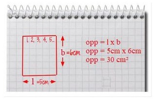

Computationeel denken is een probleem op een zodanige manier benaderen dat het uiteindelijk opgelost kan worden door een computer. Via een bepaald proces bekijken 
we het probleem en zoeken zo naar de efficiëntste manier om tot een oplossing te komen. Er komen bij computationeel denken zes ‘concepten’ of stappen aan bod.

1. Logisch denken
2. Decompositie
3. Patroonherkenning
4. Abstractie
5. Algoritmen
6. Evaluatie

Op puntje 5. gingen we reeds dieper in. We bespreken kort de overige concepten. Deze komen terug doorheen de cursus.

## Logisch denken
Logische redeneringen helpen ons uit te leggen waarom iets gebeurt. Wanneer je twee dezelfde computers dezelfde instructies geeft (dus hetzelfde programma laat
uitvoeren) en ze daarvoor ook dezelfde invoerwaarden meegeeft, dan kun je dezelfde uitkomst verwachten.

Computers gaan niet zomaar iets uitvinden. Ze gaan ook niet plots op een andere manier te werk, afhankelijk van hoe ze zich op dat moment toevallig voelen. Ze zijn
voorspelbaar. Door logisch te redeneren kunnen wij op dezelfde manier te werk gaan als een computer.

Onder 'logica' verstaan we het correct redeneren. Door middel van logica kun je vanuit bekende feiten nieuwe feiten afleiden. Je spreekt dan van "logisch 
redeneren". In feite zijn computers niets meer dan apparaten die strikt logisch redeneren; ze zijn geprogrammeerd volgens logische regels.

Dit proces waarin we bestaande kennis gebruiken om betrouwbare voorspellingen te maken, is een onderdeel van logisch redeneren. In essentie draait logisch redeneren
rond het kunnen uitleggen van waarom iets doet wat het doet. Het kan daarnaast ook helpen om inzicht te krijgen in waarom iets niet werkt op de manier die we
verwachten.

## Decompositie
Veel problemen lijken op het eerste zicht te moeilijk om op te lossen. Decompositie gaat over het verdelen van een ingewikkeld probleem in verschillende kleine(re) 
problemen die je afzonderlijk kan oplossen. Het zorgt ervoor dat we een probleem kunnen beheersen en dat de oplossing veel haalbaarder wordt: grote problemen zijn 
ontmoedigend, maar een reeks kleinere, gerelateerde taken is veel gemakkelijker aan te pakken. Een groot probleem opdelen in kleinere deelproblemen kan ook samenwerking stimuleren, waarbij elke medewerker zijn eigen inzichten, ervaringen en vaardigheden kan inbrengen.

Neem het probleem 'een boterham met kaas, confituur en chocomelk maken' als voorbeeld. Dat kan opgedeeld worden in een aantal taken.

Problemen ontleden in kleinere delen, komt niet enkel voor in programmeren: het is ook zowat het basisprincipe dat iedere ingenieur, ontwerper of projectleider 
toepast.

Softwareontwikkeling is een complex proces. Een groot project kunnen opdelen in verschillende onderdelen is dus essentieel. Denk maar aan alle verschillende 
elementen die moeten worden gecombineerd om een computerprogramma (zoals PowerPoint) te maken. Hetzelfde geldt voor: een laptop of een tablet, een fiets, 
koffiezetapparaat ... Deze toestellen zijn zelf samengesteld uit vele, los van elkaar gemaakte componenten die daarna moeten worden samengevoegd.

## Patroonherkenning
Onze wereld wordt gedomineerd door patronen. We definiëren patronen als dingen die zich herhalen of sterke gelijkenissen vertonen. Een belangrijke vaardigheid 
is het herkennen van patronen in probleemstellingen. Dit stelt je in staat om veel sneller nieuwe problemen op te lossen door de reeds gekende oplossing van het
patroon toe te passen. Zo is het opzoeken van de juiste bus kinderspel wanneer je reeds met de trein of metro overweg kan. De tijdstabellen alsook het concept
tussenstops zijn immers voor allen gelijkaardig.

Wanneer het concept 'oppervlakte' geïntroduceerd moet worden, leren leerlingen eerst de oppervlakte van een rechthoek leren berekenen door het aantal vierkante
centimeters ervan te tellen. Een betere oplossing bestaat er echter in om de lengte te vermenigvuldigen met de breedte van de rechthoek. Die methode is niet enkel
sneller, ze werkt ook voor alle mogelijke rechthoeken - ongeacht hoe groot die zijn.

Computerwetenschappers proberen problemen op een snelle en efficiënte manier op te lossen. De methoden die ze daarvoor gebruiken, willen ze later opnieuw kunnen 
toepassen. Als ze een gemeenschappelijk patroon zien tussen verschillende problemen of computerprogramma’s, dan zullen ze met één oplossingsmethode komen die ze
daarna kunnen hergebruiken. Op die manier hoeven ze het werk maar één keer te doen.

Ook computers kunnen getraind worden om patronen te herkennen in een grote hoeveelheid data zoals het automatisch herkennen van nummerplaten en gezichten.

## Abstractie
Abstractie komt van het Latijnse woord ‘abstráhere’ en betekent ‘weglaten’. Komen tot de essentie behoort tot de kern van computationeel denken. Abstractie gaat
over zaken eenvoudiger maken, over het identificeren van zaken die belangrijk zijn zonder je veel om details te bekommeren. Abstractie is dus een manier om met
complexiteit om te gaan. Op een metrokaart bijvoorbeeld staan alleen de essentiële verbindingen en stations. Overbodige gegevens zoals hoogteligging worden niet
weergegeven.

Abstractie is belangrijk om een probleem eenvoudig te kunnen oplossen en om een probleem aan een computer te kunnen voorleggen.

## Evaluatie
In de computerwetenschappen wordt er op een zeer systematische en grondige manier geëvalueerd. Daarbij wordt de kwaliteit, de effectiviteit en de efficiëntie van
oplossingen, systemen, producten en processen beoordeeld. Tijdens de evaluatie wordt nagegaan of voorgestelde en uitgewerkte oplossingen inderdaad datgene doen
waardoor ze werden ontwikkeld. Een systematische evaluatie beantwoordt aan:

* Welbepaalde criteria: specificaties, een welomschreven ontwikkeldoel;
* Behoeften van gebruikers: wie zijn de gebruikers, wat willen ze?
