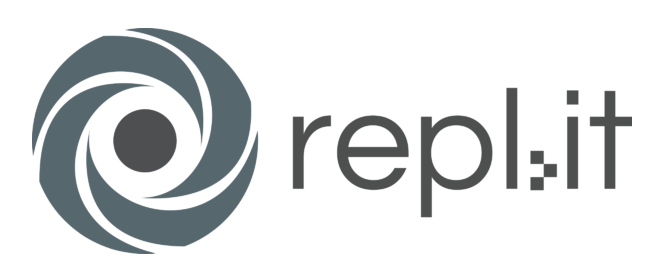
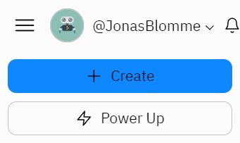
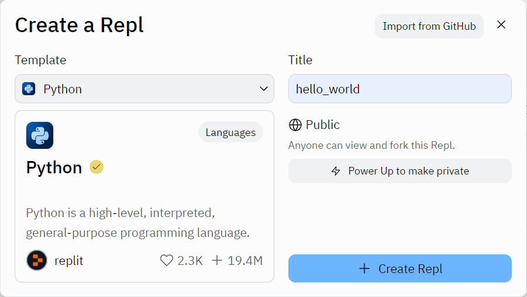

## De programmeertaal: Python

De voorbije jaren hebben jullie misschien al wat geprogrammeerd met behulp van Scratch, op je grafische rekenmachine of zelfs met Lego Mindstorms. Dit jaar schakelen we over naar **tekstueel programmeren** met behulp van de codeertaal Python. We kiezen voor **Python** als programmeertaal. Er zijn enkele goede redenen om te kiezen voor Python:

* Python heeft een relatief eenvoudige syntax en is daardoor eenvoudig aan te leren. Python is dus een uitstekende keuze om de basisprincipes van computationeel denken aan te brengen.
* Ondanks zijn eenvoudige syntax is Python toch bijzonder krachtig. Door libraries of modules te importeren in je programma, is Python geschikt voor de meest uiteenlopende toepassingen. Dankzij die veelzijdigheid is Python op dit moment wellicht de meest gebruikte programmeertaal ter wereld.
* Python is volledig open source. Dat maakt dat iedereen Python volledig gratis mag gebruiken. Je vindt de meest recente versie van Python steeds op <a href="https://www.python.org/downloads/>www.python.org/downloads/" target="_blank" rel="noopener noreferrer">www.python.org/downloads/</a>.

## De programmeeromgeving: repl.it

Om deze code te kunnen testen zullen we gebruik maken van de online omgeving **repl.it**. Maak hiervoor een gratis account aan op <a href="https://replit.com/" target="_blank" rel="noopener noreferrer">repl.it</a>. Kies bij voorkeur een username van de vorm VoornaamAchternaam, zodat de leerkracht je naam gemakkelijk herkent indien nodig. Je moet tijdens het aanmaken van je account ook een e-mailadres opgeven waarop je een verificatiemail zal krijgen. Dit e-mailadres wordt verder niet gebruikt tijdens deze lessenreeks. Het voordeel van deze online programmeeromgeving is dat je overal kan verderwerken aan je code, je hoeft bijvoorbeeld thuis geen extra programma’s te installeren.

In onderstaand filmpje krijg je een rondleiding in repl.it:

<iframe width="560" height="315" src="https://www.youtube.com/embed/EIE9dOBSLKE" title="YouTube video player" frameborder="0" allow="accelerometer; autoplay; clipboard-write; encrypted-media; gyroscope; picture-in-picture; web-share" allowfullscreen></iframe>

Deze video maakt deel uit van de reeks <a href="https://www.youtube.com/playlist?list=PL2iW_rkiCt7UqxL47lGkBaTgApj_QHJ0K" target="_blank" rel="noopener noreferrer">Leren programmeren: Python</a> van <a href="https://www.youtube.com/c/UHasseltTutorials" target="_blank" rel="noopener noreferrer">UHasselt Tutorials</a>. We zullen de video’s uit deze reeks later in deze lessenreeks nog gebruiken.

## Je eerste programma: Hello, World!

Via repl.it maken we een eerste programma aan. Kies voor **Create Repl**, geef dit programma de naam ‘hello_world’ en kies voor Python als **Template**. Bevestig tot slot met **Create Repl**.

  
  

