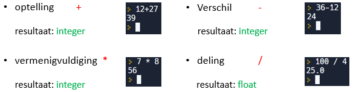
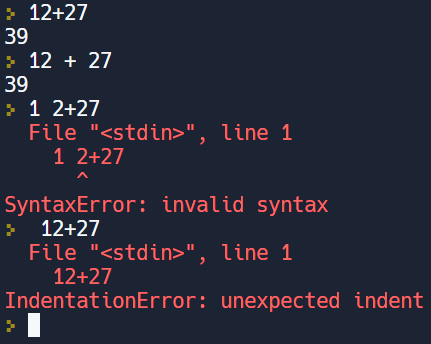

In deze video tonen we je hoe je eenvoudige berekeningen met 2 gehele getallen kan uitvoeren in Python en leer je de datatypes integer en float kennen.

<iframe width="560" height="315" src="https://www.youtube.com/embed/iP78KB8QPg0" title="YouTube video player" frameborder="0" allow="accelerometer; autoplay; clipboard-write; encrypted-media; gyroscope; picture-in-picture; web-share" allowfullscreen></iframe>

## Gehele getallen en rekenkundige operatoren
* **Integer** : geheel getal (..., -3, -2, -1, 0, 1, 2, 3, ...)
* Operatoren : +  -  *  /

## Getalvormen

<ul> 
    <li> <b>Float</b>: rationaal getal
         <ul>
             <li> Bij deling van twee gehele getallen krijgen we als antwoord een rationaal of een float.</li>
             <li> Als decimaal teken wordt een punt gebruikt.</li>
         </ul>
    </li>
    <li>De som, het verschil en het product van integers levert als resultaat opnieuw een <b>integer</b> op. De deling van integers levert echter een float op.</li>
</ul>

Gehele getallen en decimale getallen zijn verschillende getalvormen. In Python zijn het verschillende **datatypen**.

## Spaties in Python
* Spaties tussen getallen en operatoren is geen probleem.
* Spaties tussen getallen $$\rightarrow$$ foutmelding (SyntaxError: invalid syntax)
* Spaties bij begin regel $$\rightarrow$$ foutmelding (IndentationError: unexpected indent)
* Aanwezigheid van spaties kunnen de leesbaarheid van de code verhogen.

  
De syntax zijn de taalregels in een programmertaal. De syntax geeft aan welke tekens of symbolen er gebruikt mogen of moeten worden. Houden we ons niet aan de syntaxregels dan kan de code niet uitgevoerd worden. Python begrijpt dan niet wat we bedoelen!

## REPL-cyclus
* **Read**: Python leest wat er staan.
* **Evaluate**: Python begrijpt en voert uit.
* **Print**: Python toont op het scherm.
* **Loop**: Python geeft beurt terug.

## Goed om te weten
* Elke berekening heeft zijn eigen specifieke teken (+,-,*,/,...). Dit zijn rekenkundige operatoren.
* De P in REPL staat ook voor PROCESS (verwerken). Er wordt immers niet altijd iets geprint.
* In de editor noteer je opeenvolgende commando’s. Die worden vervolgens na elkaar uitgevoerd. In de CLI zou de uitvoering - coderegel per coderegel - omslachtig zijn. Een reeks opeenvolgende commando’s noemen we een script. Een script kan je opslaan en een bestandsnaam geven.
* De Python stijlgids (style guide) is een verzameling van vormvoorschriften. Door het volgen van die vormvoorschriften blijft je Pythoncode vlot leesbaar. De stijl gaat over de vorm van de code en dus niet over de syntax. Zo schrijft de stijlgids voor dat je bij een rekenkundige operator bij voorkeur een spatie zet voor en na de operator. Dus liever 5 + 2 dan 5+2. Wanneer veschillende ontwikkelaars dezelfde stijl gebruiken, kunnnen ze elkaars code makkelijk lezen.
In Python wordt er naar de stijlgids verwezen als PEP 8 (PEP staat voor Python Enhancement Proposal).
* Elk datatype (integer, float,...) dat we leren kennen in een programmertaal, heeft zijn bestaansreden. Leren programmeren betekent onder andere de verschillende datatypes en hun eigenschappen leren kennen. Die kennis laat ons toe om tijdens het programmeren Python’s reactie op een commando te voorspellen.
