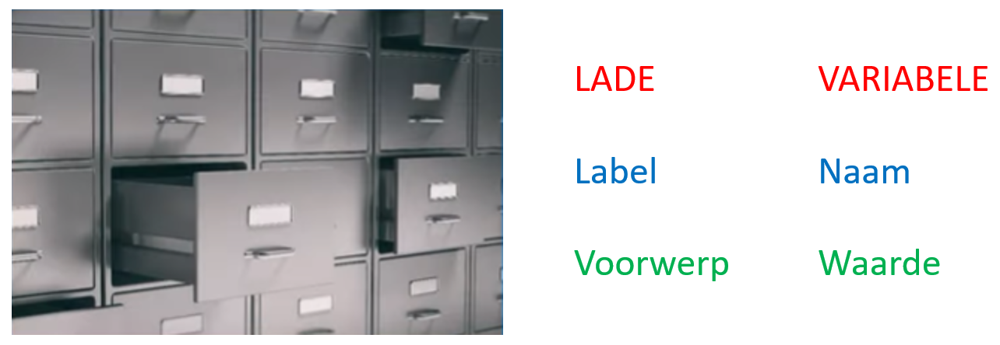

In deze video is er slechts één doel, duidelijk maken wat variabelen zijn. We ontdekken wat de overeenkomsten zijn tussen een lade en een variabele & we leren de juiste woorden kennen, om over variabelen te denken en te spreken.

<iframe width="560" height="315" src="https://www.youtube.com/embed/rKFJ8tRvqFk" title="YouTube video player" frameborder="0" allow="accelerometer; autoplay; clipboard-write; encrypted-media; gyroscope; picture-in-picture; web-share" allowfullscreen></iframe>

# Analogie

  
<b>Lades</b> laten toe <b>spullen</b> op te bergen tot ze weer nodig zijn ...

  
<b>Variabelen</b> laten toe <b>waarden</b> op te slaan tot ze weer nodig zijn ...

Het geheugen van Python kan je vergelijken met een kast met lades:

* Zoals je een voorwerp kan op slaan in een lade,   zo kan je een waarde opslaan in een variabele.
* Bij een lade helpt het label het voorwerp terug te vinden,   bij een variabele helpt de naam de waarde terug te vinden.
* Zoals er geen 2 lades zijn met hetzelfde label,   zijn er geen 2 variabelen met dezelfde naam.
