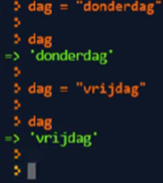
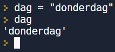
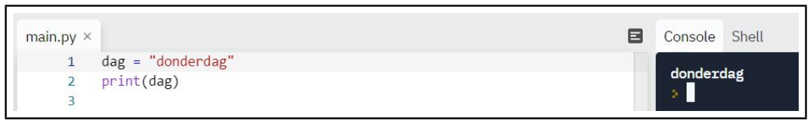
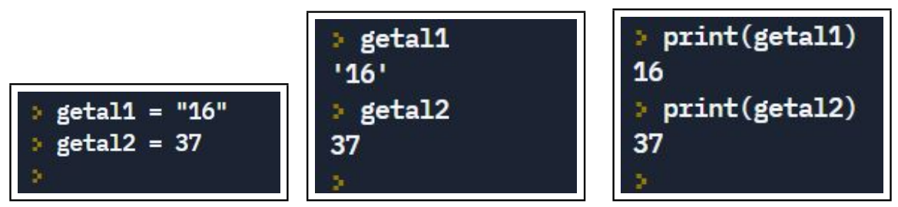

In deze video creëren we variabelen, geven ze een naam en kennen er een waarde aan toe.

<iframe width="560" height="315" src="https://www.youtube.com/embed/V58gHCwSxrw" title="YouTube video player" frameborder="0" allow="accelerometer; autoplay; clipboard-write; encrypted-media; gyroscope; picture-in-picture; web-share" allowfullscreen></iframe>

## Beschrijving van het assignment statement

  <ul>
    <li> Een assignment statement bundelt drie processen
      <ul>
        <li> creëren van een variabele </li>
        <li> naam geven aan de variabele </li>
        <li> waarde toekennen aan de variabele </li>
      </ul>
    </li>
    <li> De toekenning herken je aan de aanwezigheid van 1 is-gelijk-aan-teken. 
         LINKS van ’=’ staat de NAAM van de variabele. 
         RECHTS van ’=’ staat de WAARDE van de variabele.
    </li>
  </ul>

## Over de naam van een variabele

  <ul>
    <li> De naam van een variabele mag geen spaties bevatten.  
         Omwille van leesbaarheid: vervang spatie door liggend streepje (_).
    </li>
    <li> De naam van variabele moet starten met letter of een liggend streepje. </li>
    <li> Een naam van een variabele mag slechts bestaan uit letters, cijfers, en een liggend streepje. </li>
    <li> Je mag zowel hoofd- als kleine letters gebruiken in namen van variabelen, maar je moet wel beseffen dat Python “case sensitive” is, dus gevoelig voor de              verschillen tussen hoofd- en kleine letters. Bijvoorbeeld, de variabele naam <code>wereld</code> is voor Python niet hetzelfde als de variabele naam                  <code>Wereld</code>. </li>
    <li> Een naam van een variabele mag geen gereserveerd woord zijn. “Gereserveerde woorden” (of “keywords”) zijn:
<pre><code>False       class       finally     is          return
None        continue    for         lambda      try
True        def         from        nonlocal    while
and         del         global      not         with
as          elif        if          or          yield
assert      else        import      pass
break       except      in          raise </code></pre>
    </li>
  </ul>

## Over de waarden van een variabele

  <ul>
    <li> Waarden kunnen wijzigen (net zoals de inhoud van een lade kan wijzigen).</li>
    <li> Je kan de waarde dus aanpassen.</li>
    <li> Python onthoudt enkel de laatste toegekende waarde.
      

        
      

    </li>
  </ul>

## De toegekende waarde achterhalen

  <ul> 
    <li> <b>In de CLI</b>: naam variabele typen + ENTER
      

         
      

      ’Kijken onder de motorkap.’ (enkel in de CLI!)
    </li>
    <li> <b>In de editor</b>: de functie <code>print()</code>
      

         
      

    </li>
  </ul>

## Getal als stringwaarde versus getal als getalwaarde
* Het datatype van (waarden toegekend aan) variabelen kan je beoordelen door ’onder de motorkap’ naar die variabelen te kijken. Het onderscheid tussen de
datatypes is zichtbaar.
* Het datatype van (waarden toegekend aan) variabelen kan je NIET beoordelen door deze variabelen af te drukken (via <code>print()</code>. Het onderscheid tussen de datatypes is NIET zichtbaar.
* Voorbeeld:

  

