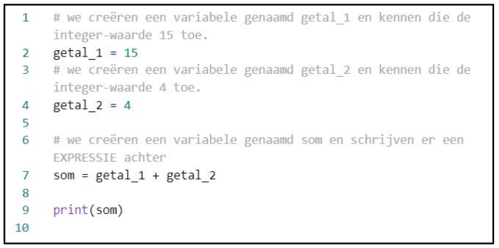

In deze video passen we de opgedane kennis met betrekking tot variabelen toe. Dat doen we door een kort programma te schrijven. Tussendoor laten we ook zien wat een expressie is en leren we commentaarregels gebruiken.

<iframe width="560" height="315" src="https://www.youtube.com/embed/KIQjDof8V-k" title="YouTube video player" frameborder="0" allow="accelerometer; autoplay; clipboard-write; encrypted-media; gyroscope; picture-in-picture; web-share" allowfullscreen></iframe>

## Programma

  

## Commentaarregels
* Start telkens met #.
* Python negeert deze regel bij uitvoering.
* Handig om extra uitleg te schrijven bij de code.
