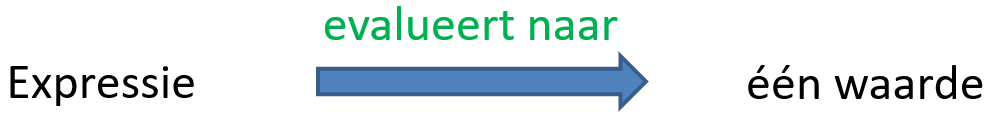

In deze video passen we de opgedane kennis met betrekking tot variabelen toe. Dat doen we door een kort programma te schrijven. Tussendoor laten we ook zien wat een expressie is en leren we commentaarregels gebruiken.

<iframe width="560" height="315" src="https://www.youtube.com/embed/KIQjDof8V-k" title="YouTube video player" frameborder="0" allow="accelerometer; autoplay; clipboard-write; encrypted-media; gyroscope; picture-in-picture; web-share" allowfullscreen></iframe>

## Programma

  

## Commentaarregels
* Start telkens met #.
* Python negeert deze regel bij uitvoering.
* Handig om extra uitleg te schrijven bij de code.

## Werken met expressies
* Een expressie is een combinatie van waarden, constanten, variabelen, operatoren,... die ge¨ınterpreteerd of ge¨evalueerd worden volgens bepaalde regels en vervolgens uitgerekend om uiteindelijk één waarde op te leveren.
* Aangezien een expressie steeds evalueert naar ´e´en waarde kunnen we overal waar we met een waarde werken ook een expressie gebruiken in Python. Dit geldt o.a. voor het assignement statement: de waarde aan de rechterzijde kunnen we vervangen door een expressie.

  

* Opmerking: print(expressie) is toegestaan.
