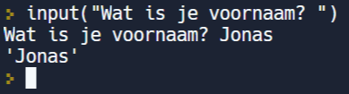

In deze video leren we de functie input() kennen, en leren we strings aan elkaar plakken.

<iframe width="560" height="315" src="https://www.youtube.com/embed/BG4Ol_vLUB8" title="YouTube video player" frameborder="0" allow="accelerometer; autoplay; clipboard-write; encrypted-media; gyroscope; picture-in-picture; web-share" allowfullscreen></iframe>

## De functie input()
* Deze functie kan een vraag stellen en het antwoord afwachten.
* Tussen de haakjes: vraag die we willen stellen
* Na het intypen van het antwoord steeds ENTER drukken.
* Opmerking: de functie print() kan hier niet voor gebruikt worden. Deze kan wel een waarde (=stringwaarde) op het scherm tonen maar wacht vervolgens NIET op een antwoord.

  

