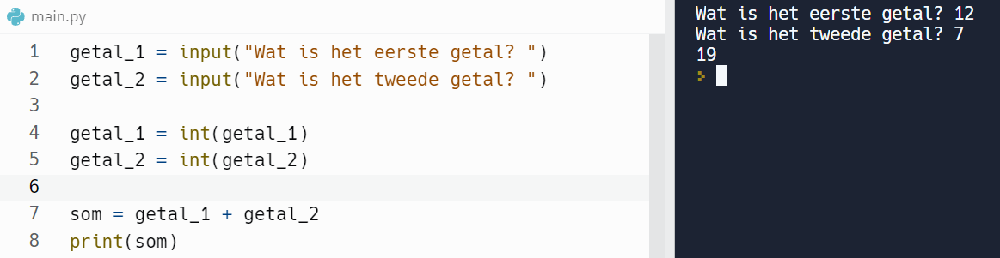
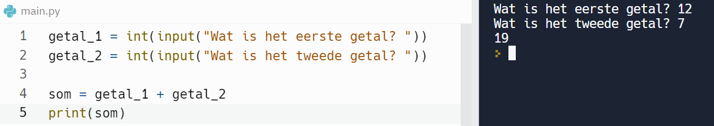

In deze video leren we de functie int() kennen, die ons toelaat een string om te zetten in een integer. Dit is de eerste uit een reeks “type conversion” functies.

<iframe width="560" height="315" src="https://www.youtube.com/embed/OH2QwmtQO88" title="YouTube video player" frameborder="0" allow="accelerometer; autoplay; clipboard-write; encrypted-media; gyroscope; picture-in-picture; web-share" allowfullscreen></iframe>

We weten ondertussen dat de waarde 12 verschilt van de waarde ”12”. De eerste waarde is een getal (een integer), de tweede waarde is een string. Integers en strings zijn verschillende datatypes. Dit verschil is belangrijk. Python gaat anders om met getallen dan met strings. Dat bleek o.a. bij de werking van het plusteken: een plusteken plakt strings aaneen, maar telt getallen op. 

## De functie int()
<ul>
  <li> int(waarde) controleert of de waarde een integer kan voorstellen. Indien dit zo is, geeft de functie die integer-waarde terug!
    

      <code>int(”15")</code> &#8594; 15
    

  </li>
  <li> Deze functie zet dus een string om naar integer.</li>
  <li> Terug naar ons programma som van 2 getallen:
    

      
    

    Een efficiëntere vorm van het programma is:
    

      
    

  </li>
  <li> De functie int() kan je ook toepassen op een floatwaarde. Een float bestaat uit 2 delen: een geheel deel en een decimaal deel. De functie int() levert het         gehele deel op van de floatwaarde!
    

      <code>int(”15.23")</code> &#8594; 23
    

  </li>
</ul>

## Uitbreiding definitie expressie
Een expressie is een combinatie van waarden, constanten, variabelen, operatoren en <b>functies</b> die geïnterpreteerd of ge¨evalueerd worden volgens bepaalde regels en vervolgens uitgerekend om uiteindelijk ´e´en waarde op te leveren.

  

## Overzicht van de reeds geziene functies
* <code>print(waarde)</code>
* <code>input(waarde)</code>
* <code>int(waarde)</code>

## Goed om te weten
<ul>
  <li> De functie int() behoort tot de groep van de type conversion functies. Het is immers een functie die het datatype convergeert (omzet) naar een ander datatype. 
  </li>
  <li> De functie int() zet o.a. een waarde van het datatype string om naar een waarde van het datatype integer. Zo is de integerwaarde beschikbaar voor verdere         verwerking.
  </li>
  
</ul>
