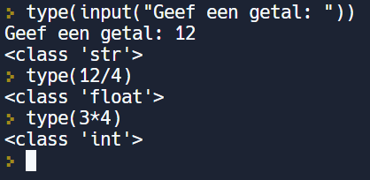

In deze video lichten we het begrip datatype toe alsook de bijpassende functie type(). We leren ook dat Python een datatype toekent aan waarden door het volgen van afspraken en regels.

  <iframe width="560" height="315" src="https://www.youtube.com/embed/RRPAAJ8mW80" title="YouTube video player" frameborder="0" allow="accelerometer; autoplay; clipboard-write; encrypted-media; gyroscope; picture-in-picture; web-share" allowfullscreen></iframe>

We weten al dat we getallen in een variabele kunnen opslaan als stringwaarde of als getalwaarde. 
Door een variabele ’onder de motorkap’ te bekijken, kan je het datatype beoordelen.

## Datatypes
Datatypes helpen programmeurs om tijdens het programmeren op een gestructureerde en efficiënte wijze hun doel te bereiken en om fouten te vermijden.
Elke programmeertaal gebruikt een aantal standaard datatypes: 
<i style="color:green;">Voorbeelden</i>: integer, float, string.

## De functie type()
* Met deze functie kan je het datatype van een waarde achterhalen.
  

    
  

* Ook een expressie mag tussen de haakjes geplaatst worden.
  

    
  

## Hoe komt een waarde aan een datatype?
Python baseert zich hiervoor op een aantal duidelijke afspraken en regels:  
<b>Afspraken:</b>
<ul>
  <li> waardie die begint en eindigt met ” ”⇒ tussen aanhalingstekens is string, </li>
  <li> waarde met aan elkaar plakkende cijfers ⇒ integer, </li>
  <li> waarde met aan elkaar plakkende cijfers met 1 punt ertussen ⇒ float. </li>
</ul>
<b>Regels:</b>
<ul>
  <li> som, verschil, prodcut van 2 integers ⇒ integer </li>
  <li> deling van 2 integers ⇒ float </li>
</ul>
