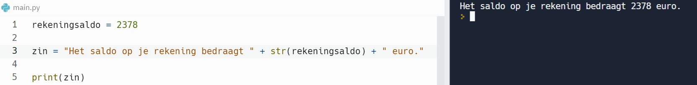

In deze video leren we de functie str() kennen, die ons toelaat om een getal om te zetten in een string. Dit is de tweede functie - na de functie int() - uit een reeks “type conversion” functies.

  <iframe width="560" height="315" src="https://www.youtube.com/embed/RG4yR9EmR_k" title="YouTube video player" frameborder="0" allow="accelerometer; autoplay; clipboard-write; encrypted-media; gyroscope; picture-in-picture; web-share" allowfullscreen></iframe>

We weten reeds hoe we een stringwaarde kunnen omzetten naar een integer-waarde, namelijk met de functie int(). Het omgekeerde komt ook veel voor. Hiervoor hebben we de functie str() nodig.

  

## Voorbeeld

  

 

## Wanneer komt die functie str() van pas?
<b style="color:green;">Voorbeeld</b> 
Je wil volgend op scherm laten verschijnen:

  <i>Het saldo op je bankrekening bedraagt 2378 euro.</i>

 
waarbij de waarde (hier 2378) aanpasbaar moet zijn. 

<b style="color:green;">Oplossing</b> 
De zin die op het scherm moet komen, bestaat uit 3 delen: 2 delen met vaste tekst en het middelste stukje dat de waarde is die toegekend is aan een variabele, vb:
rekeningsaldo. Deze 3 stukjes kunnen we aan elkaar plakken door <b>concatenation</b>. Dit lukt alleen maar als de afzonderlijke stukjes strings zijn!

  

Merk op dat de variabele nog steeds van het type integer is!

## Goed om te weten
* De functie str() is ook toepasbaar op float-waarden (float → string).
* De functie str() behoort tot de groep van de type conversion functies. Het is immers een functie die het datatype convergeert naar een ander datatype.
* De functie str() zet een bestaande waarde om naar een waarde van het datatype string. Zo is de stringwaarde beschikbaar voor verdere verwerking. Het datatype werd dus geconverteerd.
* We leerden eerder al de functie int() kennen als één van de type conversion functies.
