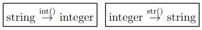
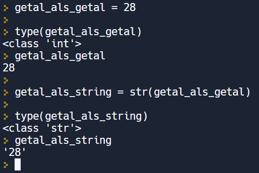

In deze video leren we de functie str() kennen, die ons toelaat om een getal om te zetten in een string. Dit is de tweede functie - na de functie int() - uit een reeks “type conversion” functies.

  <iframe width="560" height="315" src="https://www.youtube.com/embed/RG4yR9EmR_k" title="YouTube video player" frameborder="0" allow="accelerometer; autoplay; clipboard-write; encrypted-media; gyroscope; picture-in-picture; web-share" allowfullscreen></iframe>

We weten reeds hoe we een stringwaarde kunnen omzetten naar een integer-waarde, namelijk met de functie int(). Het omgekeerde komt ook veel voor. Hiervoor hebben we de functie str() nodig.

  

## Voorbeeld

  

