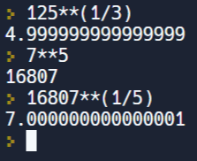

In deze video leren we hoe we een getal tot een macht verheffen en hoe we machtswortels van getallen berekenen.

  <iframe width="560" height="315" src="https://www.youtube.com/embed/yymBPl5lF3A" title="YouTube video player" frameborder="0" allow="accelerometer; autoplay; clipboard-write; encrypted-media; gyroscope; picture-in-picture; web-share" allowfullscreen></iframe>

## Syntax machtsverheffing 
Symbool machtsverheffing: **   
<b style="color:green;">Voorbeeld</b>: $$8^2$$ 

  

Het resultaat is een <b>integer</b>. 

## Syntax machtswortel
Een n-de machtswortel kunnen we als volgt schrijven:

  $$\sqrt[n]{\text{getal}} = \text{getal}^{\frac{1}{n}}$$

We hoeven dus geen nieuw symbool.  
<b style="color:green;">Voorbeelden</b>: $$\sqrt{49}$$, $$\sqrt[3]{27}$$ en $$\sqrt[4]{625}$$  

  

Het resultaat is een <b>float</b>. 

Merk op dat we niet altijd het resultaat verkrijgen dat we verwachten. 
<b style="color:green;">Voorbeelden</b>: 

  

Dit heeft verschillende redenen waar we nu niet dieper op ingaan. We houden het erop dat het gevonden resultaat het verwachte resultaat heel heel dicht benadert.

  
Opmerking: haakjes rond 1/n moeten er staan!

