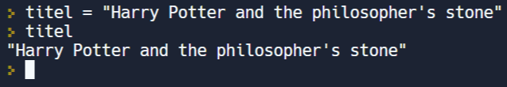

In deze video leren we naast de 4 symbolen die toelaten om strings af te bakenen o.a. de lege string kennen. De backslash als speciaal teken met een bijzondere functie passeert ook de revue.

  <iframe width="560" height="315" src="https://www.youtube.com/embed/81YEEXJAk8U" title="YouTube video player" frameborder="0" allow="accelerometer; autoplay; clipboard-write; encrypted-media; gyroscope; picture-in-picture; web-share" allowfullscreen></iframe>

## Dit weten we al
We gebruiken in Python witruimte zoals spaties om de leesbaarheid van onze code te vergroten. Dat betekent niet dat we zomaar overal spaties mogen noteren in onze code, maar een zekere vrijheid is er wel. Uiteraard moeten we rekening houden met de syntaxregels van Python. In stringwaarden bestaat er geen witruimte: elk teken telt er, dus ook elke patie.

## Gebruik van aanhalingstekens
<ul> 
  <li>Begin en einde van de string aanduiden met hetzelfde symbool.</li>
  <li>Mogelijkheden voor de symbolen:
    <ul>
      <li>enkele aanhalingsteken</li>
      <li>dubbele aanhalingsteken</li>
      <li>drievoudig enkele aanhalingsteken</li>
      <li>drievoudig dubbele aanhalingsteken</li>
    </ul>
    

      
    

  </li>
  <li>Waarom verschillende mogelijkheden? 
    <b style="color:green;">Voorbeeld</b>: 
    

      <i>Harry Potter and the philosopher’s stone</i>
    

    Voor deze string kan je geen enkelvoudig aanhalingsteken gebruiken omdat dit teken in de string zelf reeds voorkomt. Hier kan je dus opteren voor het dubbele         aanhalingsteken:
    

      
    

  </li>
</ul>
