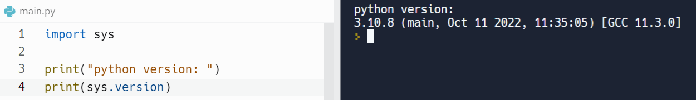
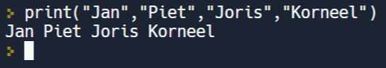

In deze video leren we
* meerdere waarden printen via één enkel print-statement
* dat die geprinte waarden standaard gescheiden worden door een spatie
* dat elke print-regel eindigt door naar een nieuwe regel te springen. We maken ook kennis met de <a href="https://www.python.org/">Python User Manual</a>.

  <iframe width="560" height="315" src="https://www.youtube.com/embed/hc5m5YPZ564" title="YouTube video player" frameborder="0" allow="accelerometer; autoplay; clipboard-write; encrypted-media; gyroscope; picture-in-picture; web-share" allowfullscreen></iframe>

We weten al dat we tussen de haakjes van de functie print() een expressie mogen noteren. Python zal de resulterende waarde afdrukken op het scherm.

## Python User Manual
* <a href="https://www.python.org/">www.python.org</a>
* Elke Python versie heeft zijn eigen documenten!
* Overzicht built-in functies (standaard Python functie) in ”library reference”

## Opvragen van de Python versie in replit.com

  

 

## Verschillende waarden afdrukken op het scherm
* Tussen de haakjes van de functie print() kunnen verschillende argumenten geplaatst worden.
* Ze moeten gescheiden worden door een komma.
* Python drukt ze achter elkaar af gescheiden met een spatie.

  

 

## Goed om te weten
De Python stijlgids raadt aan om bij een functie met meerdere argumenten buiten het verplichte scheidingsteken ook een spatie tussen de argumenten te plaatsen.
Dat komt de leesbaarheid ten goede.
