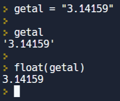

In deze video leren we de functie float() kennen, die ons toelaat een string om te zetten in een float. Dit is de derde functie - na de functies int() en str() - uit een reeks “type conversion” functies.

  <iframe width="560" height="315" src="https://www.youtube.com/embed/EQ26girUxyI" title="YouTube video player" frameborder="0" allow="accelerometer; autoplay; clipboard-write; encrypted-media; gyroscope; picture-in-picture; web-share" allowfullscreen></iframe>

## De functie float()
De functie float() is de tweelingsbroer van de functie int().
<ul>
  <li><code>int()</code>  
    
De functie int() zet een string om in een integer op voorwaarde dat deze string een sliert van cijfers is.

  </li>
  <li><code>float()</code>  
    
De functie float() zal op exact dezelfde wijze een string omzetten naar een float op voorwaarde dat deze string een sliert van cijfers is met ergens één punt          tussen.
    

    

      
    

  </li>
</ul>

## Type conversion functies
* <code>int()</code>
* <code>float()</code>
* <code>str()</code>
