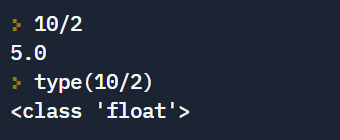

# Het datatype float
Floats, wat kort is voor “floating-point getallen” of “gebroken getallen”, zijn **getallen met decimalen**. Bijvoorbeeld: <code>3.14159265</code> is een float. Merk op dat je een punt in plaats van een komma moet gebruiken als decimaal-scheider. Veel landen (inclusief België en Nederland) gebruiken een komma als decimaal-scheider, maar Python houdt zich aan de conventie van Engelstalige landen en gebruikt daarom de punt.

## Wanneer gebruikt Python een float?
Als je een getal met een punt ingeeft, interpreteert Python dat automatisch als een float.

Daarnaast heb je in videoles 10 over datatypes ook geleerd dat de deling van twee integers automatisch een float als resultaat geeft in Python, zelfs als de deling rest 0 heeft.

## Een float omzetten naar een integer met de functie int()
Het is niet altijd handig dat Python de deling van twee integers automatisch als float labelt. We kunnen daarom het resultaat opnieuw omzetten naar een integer met de functie <code>int()</code>.

  

Let wel op: als je getal niet geheel is, gaat de functie <code>int()</code> in feite alles na de komma weglaten, zowel bij positieve als bij negatieve getallen.

10/2 geeft resultaat 5.0

Merk op dat er hierboven iets geks gebeurt voor <code>5.9999999999999999</code>. Dat is omdat we voorbij de precisie gaan waarmee Python werkt voor floats.

## Precisie van floats in Python
Er zijn bepaalde begrenzingen aan de grootte van de floats en aan de precisie. Het is onwaarschijnlijk dat je ooit de maximale groottes bereikt, aangezien Python wetenschappelijke notatie voor grote getallen gebruikt. **Maar door de manier waarop Python floats opslaat, kunnen bepaalde getallen niet precies vastgelegd worden. Dit zorgt soms wel voor problemen.**

Bijvoorbeeld: het statement <code>print((431/100)*100)</code> geeft als antwoord <code>430.99999999999994</code>, en niet 431 zoals je zou verwachten. Als je weet dat de uitkomst van een berekening waarin floats zitten een integer moet zijn, dan doe je er goed aan om de uitkomst af te ronden naar het dichtstbijzijnde gehele getal. Dat kun je doen met behulp van de <code>round()</code> functie.

10/2 geeft resultaat 5.0

# De functie round()
## Een float omzetten naar een integer met de functie round()
Zoals je hieronder ziet, gaat de functie <code>round()</code> een getal afronden naar de dichtsbijzijnde integer.

10/2 geeft resultaat 5.0

**Maar opgelet: de functie <code>round()</code> in Python volgt helaas niet altijd de afspraken die we binnen de wiskunde hebben over afronden.** In het bijzonder wanneer het eerste cijfer dat we weglaten een 5 is, wijken de regels van Python af van de wiskundige regels. Wij zouden bijvoorbeeld 1,5 afronden naar 2 en 2,5 afronden naar 3. Zoals je hieronder ziet, doet Python iets anders:

10/2 geeft resultaat 5.0

In dit geval kiest Python ervoor om af te ronden naar het dichtsbijzijnde even getal. Dit is slechts een detail, maar we vermelden het toch voor de volledigheid.

## Afronden tot op een aantal cijfers na de komma met de functie round()
Je kan met de functie <code>round()</code> een getal ook afronden tot een gegeven aantal cijfers na de komma.

10/2 geeft resultaat 5.0

Merk op: ook hier volgt Python z’n eigen regels als het eerste cijfer dat wordt weggelaten een 5 is.
