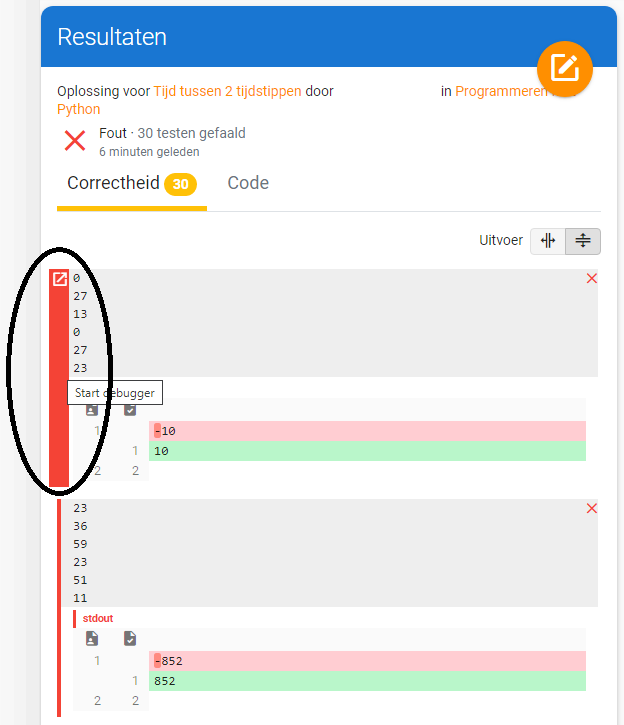

## Syntax Error
Wanneer een programma niet uitgevoerd kan worden, probeert Python aan te geven op welke lijn het probleem zich voordoet en wat het probleem precies is. Door de foutmelding te analyseren, heb je vaak snel een idee waar je moet gaan zoeken en wat er mis is.

Toch kan het voorkomen dat Python verwijst naar een lijn die perfect in orde is. Een typische situatie is wanneer er op een regel niet even veel haakjes open gaan als er haakjes sluiten. In dat geval zal Python melden dat er op de volgende regel een probleem is. Kijk naar volgend voorbeeld:

<code><pre>1   a = 3
2   print(a
3   b = 5
4   print(b)
</code></pre>

Er stelt zich duidelijk een probleem op lijn 2: het haakje van de print-functie gaat open, maar niet dicht. De foutmelding die Python geeft, is echter

<code><pre>File "main.py", line 3
b = 5
ˆ
SyntaxError: invalid syntax
</code></pre>

Python lijkt dus te suggereren dat er op lijn 3 een syntax error staat, terwijl daar in werkelijkheid niets aan de hand is.

## Runtime Error
Als er iets fout zit in code, geeft Python meestal een foutmelding. Dit zijn vaak “syntax fouten,” die aangeven dat er iets fout zit in de vorm van je code. Er zijn ook “runtime errors,” die aangeven dat je code op zich syntactisch correct lijkt, maar dat er iets fout is gegaan bij de uitvoering ervan. Een goed voorbeeld is de ZeroDivisionError, die aangeeft dat je probeerde te delen door nul (wat niet mag, zoals je weet).

## Debuggen met variabelen
Een veelvoorkomende oorzaak van functionele fouten in programma’s is dat variabelen blijken niet de waardes te bevatten waarvan je dacht dat ze ze bevatten. Een goede manier om je code te “debuggen” (dat wil zeggen, uit te vinden waar in je code fouten staan en die te verbeteren) is het printen van variabele namen op geschikte plaatsen. Bijvoorbeeld, de volgende code geeft een foutmelding als je hem uitvoert.

<code><pre>nr1 = 5
nr2 = 4
nr3 = 5
print( nr3 / (nr1 % nr2) )
nr1 = nr1 + 1
print( nr3 / (nr1 % nr2) )
nr1 = nr1 + 1
print( nr3 / (nr1 % nr2) )
nr1 = nr1 + 1
print( nr3 / (nr1 % nr2) )
</code></pre>

Misschien zie je wat het probleem is, maar stel dat je het niet ziet, hoe vind je dan uit wat er mis is? Als je het programma uitvoert, zie je dat de fout ontdekt wordt op regel 10, wat wil zeggen dat alles nog steeds werkte op regel 9.

<code><pre>Traceback (most recent call last):
  File "main.py", line 10, in <module>
    print( nr3 / (nr1 % nr2) )
ZeroDivisionError: division by zero
</code></pre>

Als je een extra regel code zet tussen regel 9 en 10, die de waarde afdrukt van nr1, nr2, nr3 and misschien ook nr1 % nr2, dan ontdek je waarschijnlijk snel wat er misloopt. print() statements veranderen niks aan de variabelen, dus je kunt ze veilig toevoegen.

Een fatsoenlijke manier om het probleem in deze code op te lossen (dus een andere manier dan gewoon de laatste regel te verwijderen) komen we later nog tegen.

Code stap voor stap laten uitvoeren in Dodona
Mislukt één van de testen in Dodona? Dan kan je de geïntegreerde debugger van Dodona gebruiken. Doordat een programma bliksemsnel wordt uitgevoerd, is het niet altijd duidelijk waarom het eindresultaat ervan misschien niet helemaal is wat je verwacht.

De ingebouwde debugger laat het programma muisklik per muisklik uitvoeren en laat zien wat er gebeurt. Zo kun je letterlijk lijn per lijn visualiseren wat er gebeurt bij het uitvoeren van de code, welke waarde een variabele toegewezen krijgt, waarom een lus wel of niet uitgevoerd wordt, … .

De ingebouwde debugger vind je bij je testresultaten. Ga naast een (fout) testresultaat staan op de rode lijn. De rode lijn wordt dikker en je kan op “start debugger” klikken.

