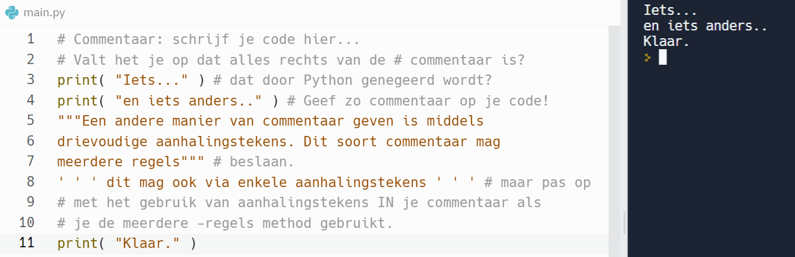

De code die je vanaf dit punt schrijft zal vaak meer dan vijf regels lang zal zijn. Dat is voldoende aanleiding om het gebruik van commentaarregels te bediscussiëren. Commentaarregels zijn teksten in code die Python negeert tijdens de uitvoering, maar die bedoeld zijn om specifieke delen van de code uit te leggen. Commentaar is niet alleen van nut voor andere mensen die je code moeten bestuderen en/of wijzigen, maar ook voor jezelf, aangezien je soms je eigen code moet wijzigen weken of maanden nadat je de code oorspronkelijk geschreven hebt, en je niet meer precies weet wat je gedaan hebt.

## Commentaar schrijven in Python
Er zijn twee manieren om commentaar op te nemen in Python code.

* De eerste manier is door gebruik te maken van het hekje of de “hash mark” (#), die aangeeft dat alles dat op dezelfde regel code rechts van de markering staat, commentaar is (mits de hash mark niet in een string staat).
* De tweede manier is door een stuk commentaar tekst, dat meerdere regels mag beslaan, vooraf te gaan door drie aanhalingstekens (dubbel of enkel), en dezelfde markering aan het einde van de tekst te zetten. In dit geval moet je de drievoudige aanhalingstekens aan het begin ook aan het begin van een regel zetten, en je kunt deze manier van commentaar geven niet gebruiken in een blok code dat inspringt. De reden is dat je feitelijk een string die uit meerdere regels bestaat in je code plaatst.

De volgende code laat voorbeelden zien van beide manieren van becommentariëren:

