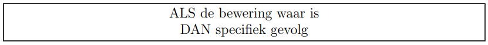

In deze video introduceren we de booleaanse expressie en leren we <code>True</code> en <code>False</code> kennen als de 2 enige Booleaanse waarden. Tot slot zien we dat er een link is tussen booleaanse expressies en de taalkundige ALS/DAN constructie. Na deze video zijn we klaar om in de volgende video het IF-statement te introduceren.

  <iframe width="560" height="315" src="https://www.youtube.com/embed/u_zh4_jnnTc" title="YouTube video player" frameborder="0" allow="accelerometer; autoplay; clipboard-write; encrypted-media; gyroscope; picture-in-picture; web-share" allowfullscreen></iframe>

## Even opfrissen
Een expressie is een combinatie van waarden, constanten, variabelen, operatoren en functies die geïnterpreteerd of geëvalueerd wordt volgens bepaalde regels en vervolgens uitgerekend om uiteindelijk één waarde op te leveren.

## Booleaanse expressie
* Een expressie is een booleaanse expressie (of bewering) wanneer de waarde waarnaar de expressie evalueert ofwel Waar (True) ofwel Onwaar (False) is.
* Het datatype van <code>True</code> en <code>False</code> is boolean (= bool).
* <code>True</code> en <code>False</code> moeten steeds met hoofdletter.

## Type conversion functie bool()
Het toepassen van de functie <code>bool()</code> op een string-, een integer- of een floatwaarde levert steeds de waarde <code>True</code> op, behalve
* als de stringwaarde overeenkomt met de lege string ””
* als de integerwaarde overeenkomt met 0
* als de floatwaarde overeenkomt met 0.0

## Nut tijdens het programmeren
Beweringen laten toe een specifiek gevolg te laten afhangen van het al dan niet waar zijn van een bepaalde bewering. 
⇒ ALS/DAN-constructie

  

## Keywords
De woorden <code>True</code> en <code>False</code> zijn in Python gereserveerd woorden of keywords. De betekenis ervan ligt vast. Keywords moeten exact gespeld worden: in dit geval dus met hoofdletter.
