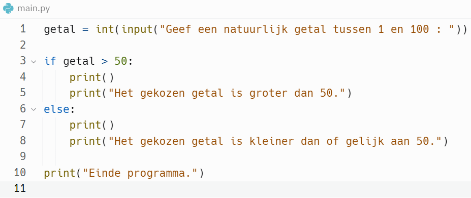

In deze video breiden we het gekende <code>if</code>-statement uit.

Naast de takenlijst, die uitgevoerd wordt als de bewering evalueert naar de waarde <code>True</code>, voegen we een alternatieve takenlijst toe, die uitgevoerd wordt als de bewering evalueert naar de waarde <code>False</code>. Hiervoor hebben we het <code>if</code>/<code>else</code>-statement nodig.

Naast de syntax-afspraken behandelen we een eerste eenvoudig voorbeeld van het <code>if</code>/<code>else</code>-statement in de editor.

  <iframe width="560" height="315" src="https://www.youtube.com/embed/eGSGV13-Z7o" title="YouTube video player" frameborder="0" allow="accelerometer; autoplay; clipboard-write; encrypted-media; gyroscope; picture-in-picture; web-share" allowfullscreen></iframe>

<ul>
  <li> ALS/DAN/ANDERS DAN 
    <b>ALS</b> <i>booleaanse expressie</i> <b>DAN</b> 
    &nbsp;&nbsp;&nbsp; <i>taak 1</i> 
    &nbsp;&nbsp;&nbsp; <i>taak 2</i> 
    &nbsp;&nbsp;&nbsp; <i>taak 3</i> 
    &nbsp;&nbsp;&nbsp; ... 
    <b>ANDERS DAN</b> 
    &nbsp;&nbsp;&nbsp; <i>alternatieve taak 1</i> 
    &nbsp;&nbsp;&nbsp; <i>alternatieve taak 2</i> 
    &nbsp;&nbsp;&nbsp; <i>alternatieve taak 3</i> 
    &nbsp;&nbsp;&nbsp; ...
  </li>
  <li> IF/ELSE in Python 
    <pre><code><b>if</b> <i>booleaanse expressie</i> :
    <i>taak 1</i>
    <i>taak 2</i>
    <i>taak 3</i> 
    ...
    <b>else :</b>
    <i>alternatieve taak 1</i>
    <i>alternatieve taak 2</i>
    <i>alternatieve taak 3</i>
    ...</code></pre>
  </li>
</ul>

## Voorbeeld
Beschouw volgend programma:

  

Er zijn 2 mogelijke uitkomsten:

<ul>
  <li> Als het opgegeven getal strikt groter is dan 50, dan wordt de "code block" onder het <code>if</code>-statement uitgevoerd.
    

      
    

  </li>
  <li> Als het opgegeven getal kleiner is dan 50 of gelijk is aan 50, dan wordt de "code block" onder het <code>else</code>-statement uitgevoerd.
    

      
    

  </li>
</ul>

## Keyword
Het woord <b>else</b> is een Python keyword
