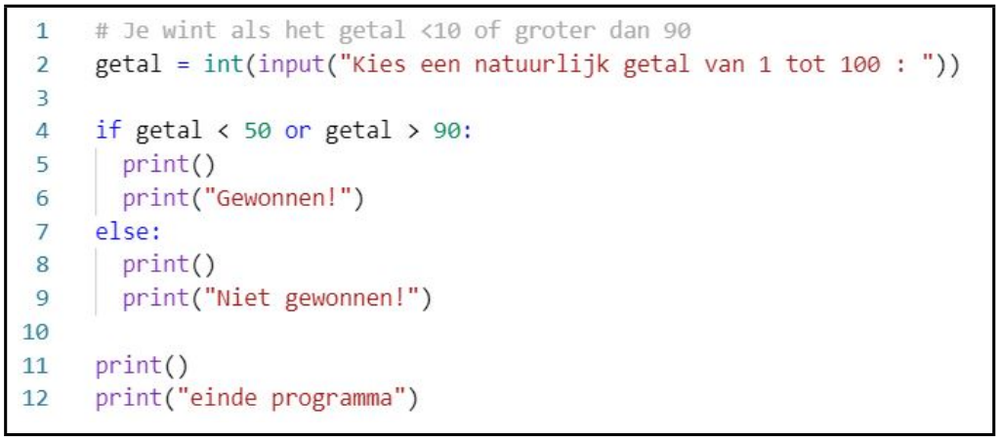

In deze video leren we 2 van de 3 booleaanse operatoren kennen. Booleaanse operatoren zullen ons toelaten om verschillende booleaanse expressies te combineren. Dat zal erg handig blijken, wanneer verschillende if-statements eenzelfde takenlijst hebben.

  <iframe width="560" height="315" src="https://www.youtube.com/embed/NYRbDIlTGlM" title="YouTube video player" frameborder="0" allow="accelerometer; autoplay; clipboard-write; encrypted-media; gyroscope; picture-in-picture; web-share" allowfullscreen></iframe>

De booleaanse operatoren zijn niet de eerste operatoren die we tegenkomen. We behandelden reeds de rekenkundige (video 3) en de relationele (video 21) operatoren.  
Er zijn 3 booleaanse operatoren: <code>or</code>, <code>not</code> en <code>and</code>.

## or
* Een samengestelde bewering met <code>or</code> is True als minstens één van de beweringen evalueert naar de waarde True is.
* Voorbeeld

  or</b>.">

## not
* not True → False
* not False → True

## Keywords
De woorden <code>or</code> en <code>not</code> zijn Python keywords.

## Goed om te weten
* Het aantal te evalueren booleaanse expressies geeft een zicht op de efficiëntie van de code. Laat de computer bij voorkeur niet te veel overbodige taken uitvoeren: elke taal taak kost extra tijd.
* Bij het evalueren van code wordt rekening gehouden met functionaliteit, leesbaarheid, aantal regels code, complexiteit, onderhoudbaarheid en efficiëntie (aantal stappen). Het volstaat dat de beginnende softwareontwikkelaar zich focust op functionaliteit. De rest komt met ervaring.
