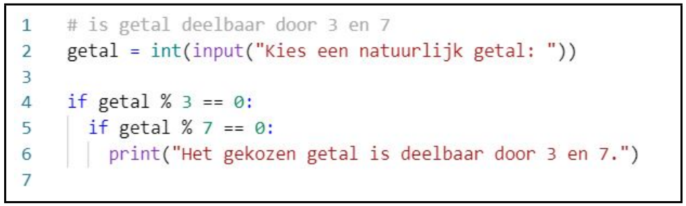
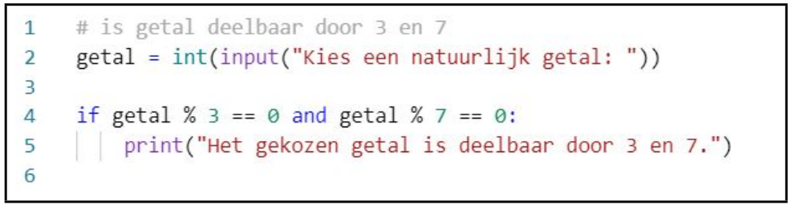

In deze video leren we de booleaanse operator and kennen. Ook deze booleaanse operator zal ons toelaten om verschillende booleaanse expressies te combineren. De booleaanse operator <code>and</code> zal erg handig blijken wanneer verschillende booleaanse expressies samen de uit te voeren takenlijst bepalen.

We leren ook de term “genest <code>if</code>-statement” kennen.

  <iframe width="560" height="315" src="https://www.youtube.com/embed/i7e_RhjIi6g" title="YouTube video player" frameborder="0" allow="accelerometer; autoplay; clipboard-write; encrypted-media; gyroscope; picture-in-picture; web-share" allowfullscreen></iframe>

## Geneste if-statements
<b style="color:green">voorbeeld</b>

  if</code>-statement.">

## and
* Ter vervanging van geneste <code>if</code>-statements.
* <b style="color:green">voorbeeld</b>

  and</code>.">

## Keyword
Het woord <code>and</code> is een Python keyword.

## Goed om te weten
Bij samengetelde beweringen met haakjes en de operatoren <code>not</code>, <code>and</code> en </code>or hebben de haakjes de absolute voorrang. Vervolgens heeft de operator <code>not</code> voorrang op de operatoren <code>and</code> en <code>or</code> en de operator <code>and</code> heeft voorrang op de operator <code>or</code>. Gebruik bij voorkeur haakjes, dan vermijd je mogelijke problemen. 

<b style="color:green">voorbeeld</b> 
True or True and False → True or (True and False) = True
